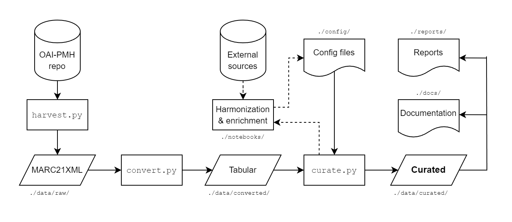

# ENB Curator

A modular pipeline for transforming and curating the **Estonian National Bibliography (ENB)** into a structured, analysis-ready dataset. This project supports large-scale, reproducible data processing to facilitate research into Estonian bibliographic data.

> **Authors**: Krister Kruusmaa, Peeter Tinits, Laura Nemvalts  
> **Institution**: National Library of Estonia  
> **License**: [MIT](https://mit-license.org/)

Related publication: [TBA]

#### If you just want to download the datasets:
- **Books**: [https://doi.org/10.5281/zenodo.14083327](https://doi.org/10.5281/zenodo.14083327)
- **Persons**: [https://doi.org/10.5281/zenodo.14094584](https://doi.org/10.5281/zenodo.14094584)

## Overview

The ENB Curator pipeline is designed for data transformation in three key stages:
1. **Harvesting** - Retrieves MARC21XML records via OAI-PMH directly from the National Library of Estonia.
2. **Conversion** - Converts MARC records to a tabular format.
3. **Curation** - Applies cleaning, harmonization, and enrichment operations to produce a coherent dataset suitable for data analysis.

This pipeline is meant to be reproducible, modular, and scalable. It is possible to adapt it for different bibliographic datasets or extended with new processing modules as needed.



### Requirements
- Python 3.8+ (3.9.12 recommended)

### Installation
1. Clone the repository:
   ```
   git clone https://github.com/RaRa-digiLab/enb-curator.git
   cd enb-curator
   ```

2. Install required packages:
   ```
   pip install -r requirements.txt
   ```

### Usage

#### Running the pipeline
- For books:
   ```
   python main.py "enb_books"
   ```
- For persons:
   ```
   python main.py "persons"
   ```

After a succesful run, you can collect the curated, up-to-date dataset from [`./data/curated`](data/curated).
The pipeline works with other collections as well (see [`.config/collections.json`](config/collections.json) for all available metadata collections of the National Library of Estonia). However, the curation module currently only supports the books and persons datasets. Other collections can be harvested and converted, but will be curated as if they were books. This can cause some mismatches and suboptimal decisions in the curating process and we recommend reviewing the relevant functions in the curation module to account for them.

#### Running parts of the pipeline separately
It is also possible to use just one module of the pipeline (e.g. you want to make changes in the curating script and run it without having do download and convert the dataset again). For example:
```
python src/curate.py "enb_books"
```

### Adapting and contributing

If you want to adapt the pipeline to your own dataset, you can try running the existing commands on your data files or an OAI access point. If you want to curate a new part of the ENB (like maps or sheet music), you are free to reuse the code. Feel free to contact us, perhaps we can help.

We welcome contributions to improve the pipeline and the quality of the curated dataset! For smaller changes, such as correcting coordinates or updating mappings, it is easiest to make the changes directly in the relevant files located in the [`./config`](config) directory. This ensures the pipeline uses the correct data in subsequent runs.

If you're familiar with GitHub, feel free to submit a pull request. If you're unsure how to do this, don't hesitate to reach out to us - we're happy to help!
